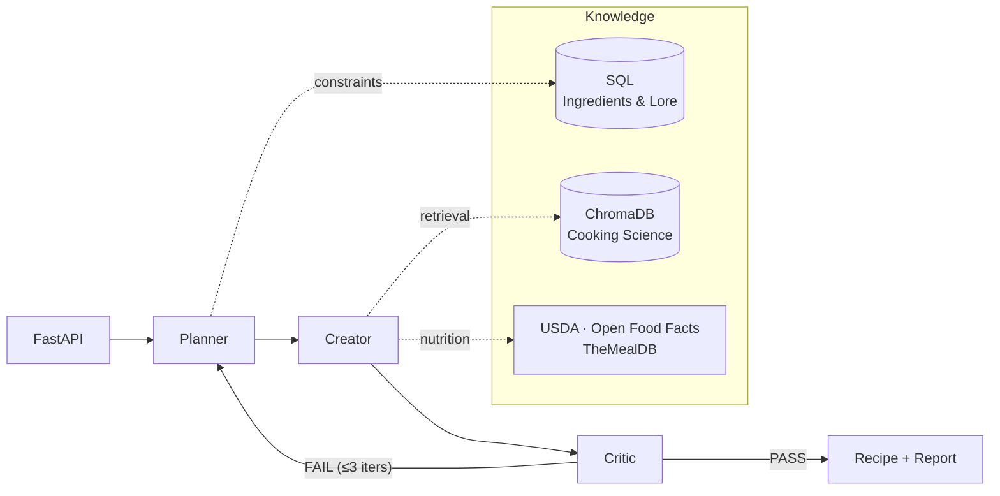

# Guzzlers-n-Dragons

> AI recipe alchemist: turns fictional ingredients (Lembas, spice melange, ambrosia...) into plausible, cookable recipes that respect thematic lore, technology level, and culinary culture — backed by real-world food science.

[](https://www.python.org/)
[](https://fastapi.tiangolo.com/)
[](https://www.langchain.com/langgraph)
[](https://github.com/jcanosan/Guzzlers-n-Dragons/actions/workflows/ci.yml)
[](LICENSE)

## Highlights

- **Multi-agent orchestration** (LangGraph): Planner → Creator → Critic with validation loop
- **Knowledge fusion**: SQL (structured lore) + RAG (cooking science) + External APIs (live data)
- **Constraint-aware generation**: Dietary, time, equipment, thematic consistency
- **Nutrition estimation**: USDA → Open Food Facts → DB lookup with LLM-based
  real-world approximation for arbitrary fictional ingredients
- **Production patterns**: Async FastAPI, Pydantic validation, Docker, CI/CD, observability

## Thematic Groups

- **fantasy**: Lembas, miruvor, cram, honey-cakes, elven wine
- **sci_fi**: Spice melange, Romulan ale, synthehol, gagh, blue milk
- **mythological**: Ambrosia, nectar, soma, golden apples, mead of poetry

## Architecture

A **multi-agent pipeline** orchestrated by LangGraph: the Planner extracts constraints and techniques, the Creator generates a recipe fusing all knowledge sources, and the Critic validates against lore, science, and cookability — feeding back to the Planner when the recipe fails thematic consistency, up to 3 iterations.



## Why these choices

- **LangGraph, not a single chain.** A recipe isn't one LLM call. Splitting generation into Planner → Creator → Critic with a feedback loop makes each stage verifiable and lets the Critic's failures drive re-planning.
- **RAG, not fine-tuning.** Cooking science is broad and updates continuously. Retrieval keeps the pipeline adaptable without needing to re-train, which is expensive. ChromaDB stores technique substitutions, texture and flavour pairing, and food-chemistry guidance.
- **Structured lore in SQL.** Ingredients, substitutions, and thematic profiles live as data that can be retrieved fast. Then agents reason over curated data instead of just relying on the model's default memory.
- **Live data via external APIs.** USDA + Open Food Facts ground nutrition in reality, while TheMealDB supplies real-world recipe patterns. The pipeline degrades gracefully when these are unavailable.

## Design docs

- [Roadmap](ROADMAP.md) - development plan
- [Technical Design](TECHNICAL_DESIGN.md) - Detailed architecture, data flow and API contracts

## Quick Start

```bash
# Install uv (if not installed)
curl -LsSf https://astral.sh/uv/install.sh | sh

# Clone and setup
git clone <repo-url>
cd Guzzlers-n-Dragons

# Create virtual environment and install dependencies
uv sync

# Copy environment file and add your API keys
cp .env.example .env

# Seed the DB (ingredients + patterns) and ingest cooking science into Chroma
PYTHONPATH=. uv run python scripts/run_seeds.py

# Run the API server
uv run uvicorn src.main:app --reload
```

API available at `http://localhost:8000`. Interactive docs (`/docs`, `/redoc`) are enabled only when `DEBUG=true` (`.env.example` sets `DEBUG=false`).

## Docker

```bash
# Build and run
docker compose -f docker/docker-compose.yml up --build

# Run tests
docker compose -f docker/docker-compose.yml --profile testing run test
```

## API Endpoints

| Method | Endpoint                      | Description                                |
| ------ | ----------------------------- | ------------------------------------------ |
| POST   | `/alchemy/transform`          | Transform fictional ingredient into recipe |
| GET    | `/alchemy/ingredients`        | List all fictional ingredients             |
| GET    | `/alchemy/ingredients/{name}` | Get ingredient details                     |
| GET    | `/health`                     | Health check                               |

## Example Request

```bash
curl -X POST http://localhost:8000/alchemy/transform \
  -H "Content-Type: application/json" \
  -d '{
    "fictional_ingredient": "spice melange",
    "meal_type": "beverage",
    "thematic_group": "sci_fi",
    "constraints": {
      "servings": 4,
      "max_prep_time_minutes": 15,
      "dietary": ["vegetarian"]
    }
  }'
```

## License

[MIT](LICENSE)
