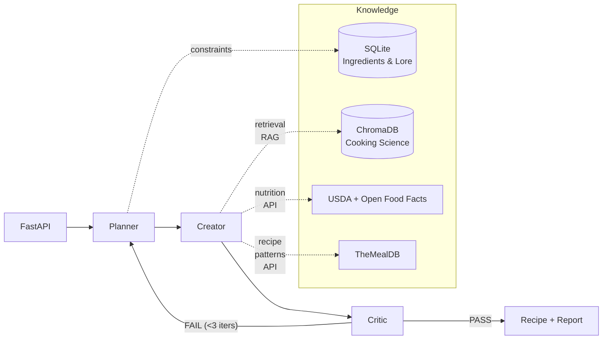

# Guzzlers-n-Dragons

AI recipe alchemist: turns fictional ingredients (Lembas, spice melange, ambrosia...) into plausible, cookable recipes. These aim to respect thematic lore, technology level, and culinary culture; all backed by real-world food science.

[Try the live demo here!](https://guzzlers-n-dragons-production.up.railway.app/)

[](https://www.python.org/)
[](https://fastapi.tiangolo.com/)
[](https://www.langchain.com/langgraph)
[](https://github.com/jcanosan/Guzzlers-n-Dragons/actions/workflows/ci.yml)
[](LICENSE)

## Highlights

- **Multi-agent orchestration with LangGraph**: Planner → Creator → Critic with validation loop
- **Knowledge fusion**
  - SQL: structured data for lore and constraints
  - RAG: cooking science
  - External APIs: live data for real recipes and nutrition info
- **Constraint-aware generation**: Dietary, time, equipment, thematic consistency
- **Nutrition estimation**: USDA → Open Food Facts → DB lookup with LLM-based
  real-world approximation for arbitrary fictional ingredients
- **Production patterns**: Async FastAPI with streaming, Pydantic validation, Docker, CI/CD, observability

## Architecture

A **multi-agent pipeline** orchestrated by LangGraph:

1. The **Planner** extracts constraints and techniques.
2. The **Creator** generates a recipe fusing all knowledge sources.
3. The **Critic** validates against lore, science, and cookability. Feeds back to the Planner when the recipe fails thematic consistency, up to 3 iterations.



### Why these choices

- **LangGraph, not a single chain.** Splitting generation into Planner → Creator → Critic with a feedback loop makes each stage verifiable and lets the Critic's failures drive re-planning.
- **RAG, not fine-tuning.** Cooking science is broad and updates continuously. Retrieval keeps the pipeline adaptable without needing to re-train, which is expensive. ChromaDB stores technique substitutions, texture and flavour pairing, and food-chemistry guidance.
- **Structured lore in SQL.** Ingredients, substitutions, and thematic profiles live as data that can be retrieved fast. Then agents reason over curated data instead of just relying on the model's default memory.
- **Live data via external APIs.** USDA + Open Food Facts ground nutrition in reality, while TheMealDB supplies real-world recipe patterns. The pipeline degrades gracefully when these are unavailable.

## Design docs

- [Roadmaps](roadmap/) - project, demo, and evaluation plans
- [Technical Design](TECHNICAL_DESIGN.md) - Detailed architecture, data flow and API contracts

## Quick Start

If you want to run this yourself.

#### Requirements:

- [uv](https://docs.astral.sh/uv/getting-started/installation/)

```bash
# Clone and setup
git clone <repo-url>
cd Guzzlers-n-Dragons

# Create virtual environment and install dependencies
uv sync

# Copy environment file and add your API keys
cp .env.example .env

# Seed the DB (ingredients + patterns) and ingest cooking science into Chroma
PYTHONPATH=. uv run python scripts/run_seeds.py

# Run the API server
uv run uvicorn src.main:app --reload
```

API will be available at `http://localhost:8000`.

Interactive docs (`/docs`, `/redoc`) are enabled only when `DEBUG=true` in environment.

Rate limiting is off by default. Enable with the env variable `RATE_LIMIT_ENABLED=true` and set the limit via `RATE_LIMIT`. See defaults in `.env.example`.

### Docker

```bash
# Build and run
docker compose -f docker/docker-compose.yml up --build

# Run tests
docker compose -f docker/docker-compose.yml --profile testing run test
```

### Try the demo

If you want to run a demo script:

```bash
PYTHONPATH=. uv run python scripts/demo.py --ingredient "spice melange" --theme sci_fi --meal-type beverage
```

[Sample output](examples/demo-output.txt):


## API Endpoints

| Method | Endpoint                      | Description                                |
| ------ | ----------------------------- | ------------------------------------------ |
| POST   | `/alchemy/transform`          | Transform fictional ingredient into recipe |
| POST   | `/alchemy/transform/stream`   | Stream the agent pipeline as SSE events    |
| GET    | `/alchemy/ingredients`        | List all fictional ingredients             |
| GET    | `/alchemy/ingredients/{name}` | Get ingredient details                     |
| GET    | `/health`                     | Health check                               |

### Example Request

```bash
curl -X POST http://localhost:8000/alchemy/transform \
  -H "Content-Type: application/json" \
  -d '{
    "fictional_ingredient": "spice melange",
    "meal_type": "beverage",
    "thematic_group": "sci_fi",
    "constraints": {
      "servings": 4,
      "max_prep_time_minutes": 15,
      "dietary": ["vegetarian"]
    }
  }'
```

## License

[MIT](LICENSE)
